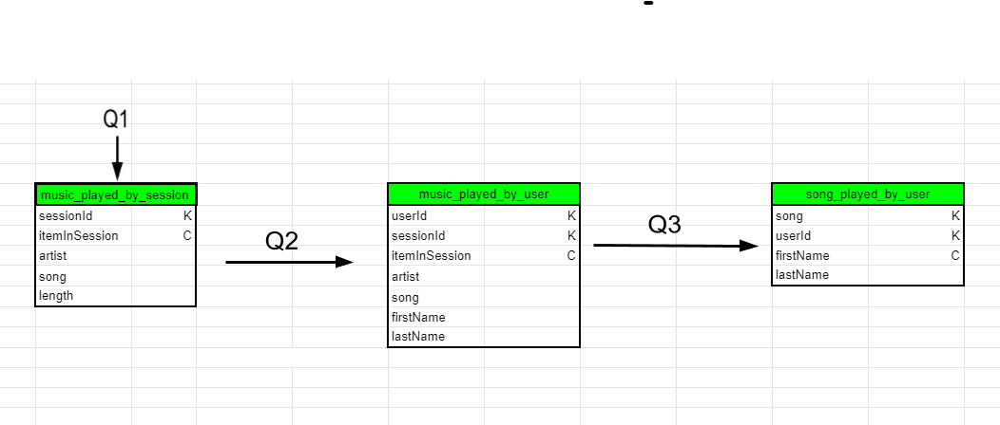

# Data Modeling with Apache Cassandra

A startup called Sparkify wants to create an Apache Cassandra database with tables designed to run queries on song play data. Currently data collected on user activity are saved in a directory of CSV files. This project attempts to model the data by creating tables in Apache Cassandra to run queries. An ETL pipeline is developed using Python that transfers data from a set of CSV files within a directory to create a streamlined CSV file to model and insert data into Apache Cassandra tables.

### Cassandra Schema Design

The below tables were created to support to the required queries.

### Usage

Open the jupyter notebook and run the cells.
